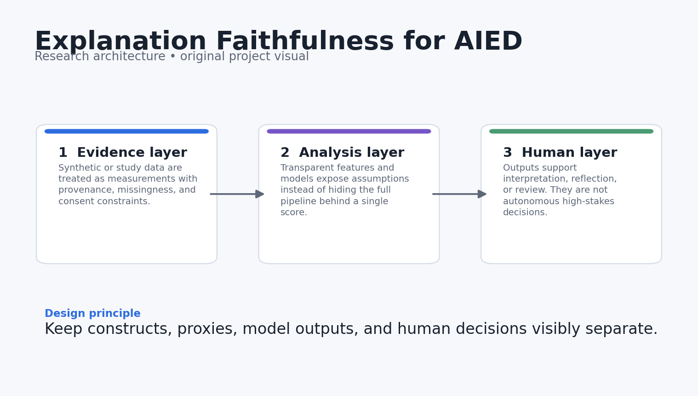
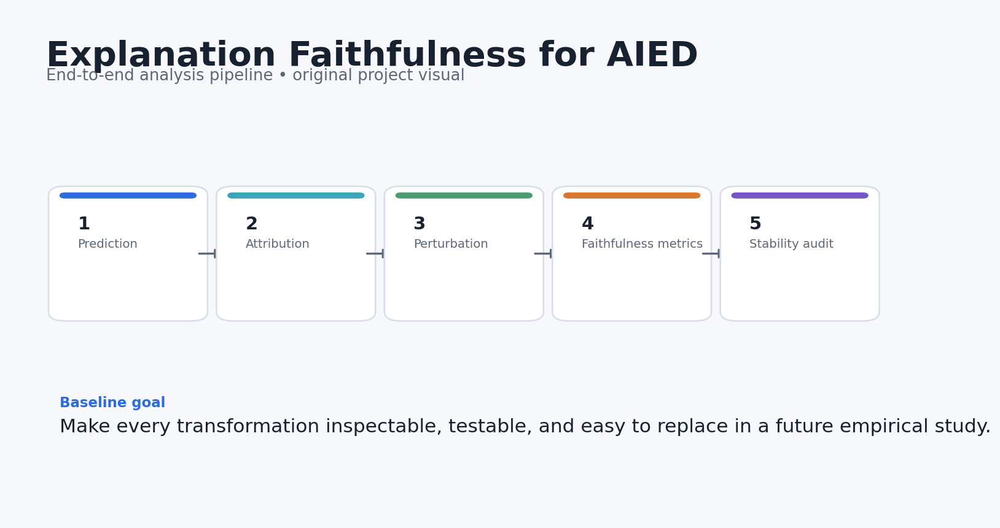
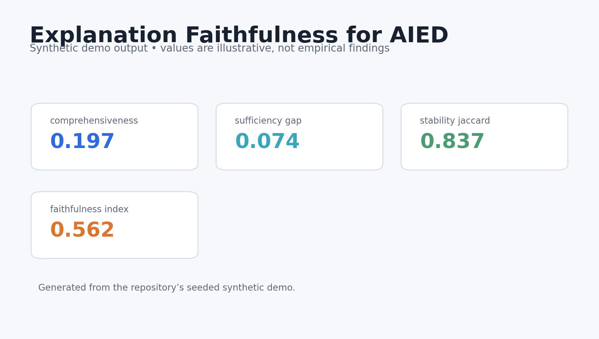
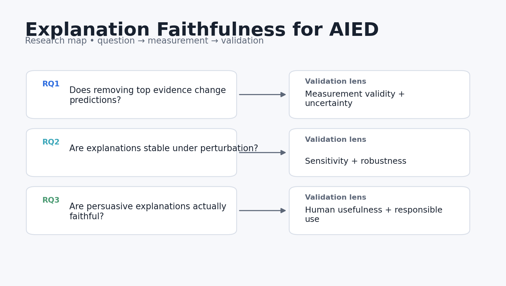

# Explanation Faithfulness for AIED

[](https://github.com/devissaputra/explanation_faithfulness_aied/actions/workflows/ci.yml)


**Category:** AI in Education
**A small, reproducible lab for testing whether educational AI explanations track the model’s actual decision process.**

> Research prototype. All bundled data and results are synthetic demonstrations. Nothing in this repository should be interpreted as evidence about real learners, teachers, or institutions.



## Why this project exists

An explanation can sound convincing while being weakly connected to the prediction it claims to explain. This repo focuses on that gap. It provides model-agnostic metrics for comprehensiveness, sufficiency, and stability and keeps “plausible” separate from “faithful.”

The evaluation separates prediction, attribution, perturbation, and stability checks so an explanation can be tested against what the model actually uses instead of judged only by how convincing it sounds.

## Research questions

1. Does removing top-attributed evidence materially change a model prediction?
2. Are the selected explanatory features stable under small input perturbations?
3. How do faithful explanations compare with persuasive but weakly grounded rationales?

## What the repository does



The reference pipeline follows five stages:

1. **Prediction**
2. **Attribution**
3. **Perturbation**
4. **Faithfulness metrics**
5. **Stability audit**

The baseline stays small enough to inspect end to end before connecting it to larger models or human explanation studies.

## Core outputs

- `comprehensiveness`
- `sufficiency_gap`
- `stability_jaccard`
- `random_baseline_delta`
- `faithfulness_index`



The dashboard above is generated from **synthetic data** and is included only to show what the analysis surface looks like. It is not a reported empirical result.

## Quick start

```bash
python -m venv .venv
source .venv/bin/activate  # Windows: .venv\Scripts\activate
pip install -e .[dev]
python examples/demo.py
pytest -q
```

You can also use Docker:

```bash
docker build -t explanation_faithfulness_aied .
docker run --rm explanation_faithfulness_aied
```

## Repository structure

```text
explanation_faithfulness_aied/
├── src/explanation_faithfulness_aied/        # core implementation and synthetic-data generator
├── examples/demo.py        # end-to-end reproducible demo
├── tests/                  # executable unit tests
├── docs/                   # research design, data dictionary, references
│   └── images/             # original project diagrams and demo visualisations
├── results/                # synthetic demo outputs only
├── config/default.yaml
├── Dockerfile
├── Makefile
└── pyproject.toml
```

## Research design in one picture



The fuller design rationale is in [`docs/research_design.md`](docs/research_design.md), including constructs, assumptions, validation steps, and a proposed empirical extension.

## Reproducibility choices

- Synthetic generation uses a fixed random seed.
- The core metrics are implemented as small, testable functions.
- The demo writes machine-readable results into `results/`.
- CI runs the tests on every push and pull request.
- No API keys, proprietary datasets, or external model calls are required for the baseline.

## Responsible-use boundaries

- The demo operates on synthetic probability traces rather than a production model.
- Faithfulness and human usefulness are separate properties and should be evaluated separately.
- No single metric is sufficient to certify an explanation as trustworthy.

## Strong next experiments

- Connect the harness to a transformer classifier and SHAP/Integrated Gradients.
- Add deletion/insertion curves and counterfactual tests.
- Run educator studies comparing faithfulness, usefulness, and cognitive load.

## References

See [`docs/references.md`](docs/references.md). The references are there to locate the project in current AIED, learning-analytics, human-centered AI, and instructional-design research. They do **not** imply endorsement or affiliation.

## Citation

If you build on this research prototype, use the metadata in [`CITATION.cff`](CITATION.cff).

## License

MIT for the code in this repository. Research data from future studies should use a separate data-governance and consent process.
